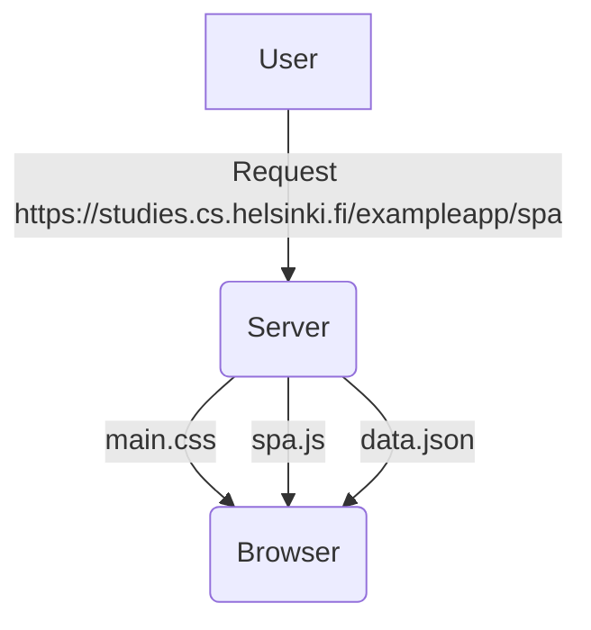

# 0.5: Diagrama de aplicación de una sola página

```mermaid
flowchart TD
    A[User] -->|Request https://studies.cs.helsinki.fi/exampleapp/spa| B(Server)
    B -->|main.css| C(Browser)
    B -->|spa.js| C(Browser)
    B -->|data.json| C(Browser)
```
