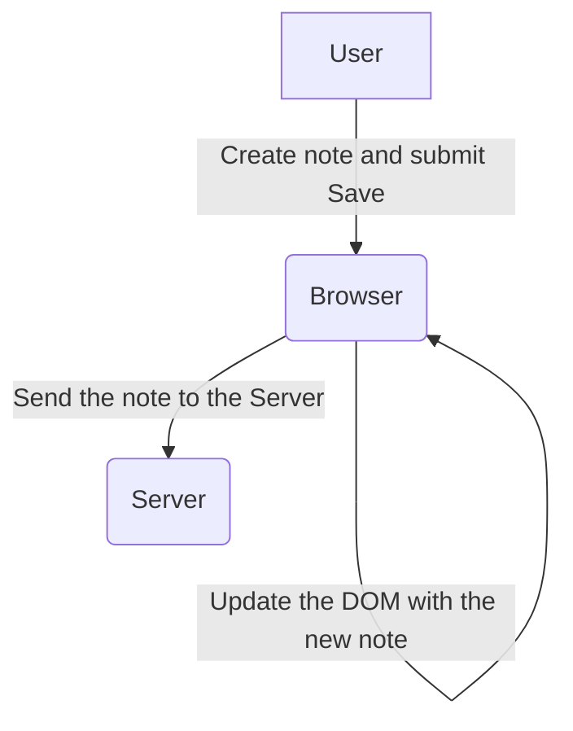

# 0.6: Nueva nota en diagrama de aplicación de una sola pagina

```mermaid
flowchart TD
    A[User] -->|Create note and submit Save| B(Browser)
    B -->|Update the DOM with the new note| B(Browser)
    B-->|Send the note to the Server| C(Server)
```
